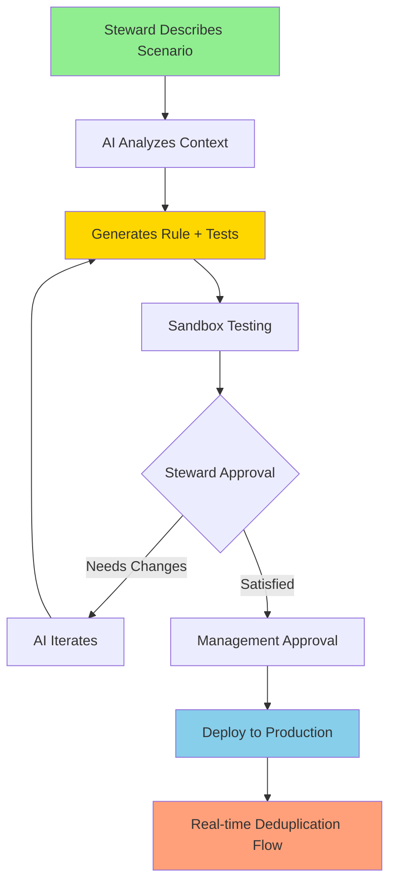

@# AI Business Rule Engine - Complete Implementation Specification

## Executive Summary

The AI Business Rule Engine transforms domain experts into rule creators through conversational AI, eliminating the traditional developer bottleneck in business rule creation. Data stewards like Janis can describe complex business scenarios in plain English and receive production-ready TypeScript rules within minutes, complete with test cases and documentation.

## Core Engine Architecture

### What It Is
A conversational AI system that generates, tests, and deploys business rules for master data deduplication in real-time. The engine combines Claude's natural language understanding with automated code generation, testing frameworks, and hot deployment capabilities.

### How It Works


### Technical Stack
- **AI Engine**: Claude 3.5 Sonnet via Anthropic API
- **Code Generation**: TypeScript with comprehensive type safety
- **Testing Framework**: Jest with automated test case generation
- **Deployment**: Hot module replacement for zero-downtime updates
- **Integration**: React components with shadcn/ui design system
- **Backend**: Node.js API with PostgreSQL rule storage

## File Structure & Implementation Location

### Directory Structure
```
src/
├── components/
│   ├── ai-rule-builder/
│   │   ├── ConversationalInterface.tsx
│   │   ├── RuleCodeEditor.tsx
│   │   ├── TestingFramework.tsx
│   │   ├── DeploymentManager.tsx
│   │   └── index.ts
│   ├── business-rules/
│   │   ├── RuleLibrary.tsx
│   │   ├── RuleCard.tsx
│   │   ├── RuleMetrics.tsx
│   │   └── index.ts
│   └── dashboard/
│       └── BusinessRulesTab.tsx (integrate into existing dashboard)
├── lib/
│   ├── rule-engine/
│   │   ├── types.ts
│   │   ├── generator.ts
│   │   ├── executor.ts
│   │   └── validator.ts
│   └── ai/
│       ├── claude-client.ts
│       └── prompt-templates.ts
├── api/
│   ├── ai/
│   │   ├── generate-rule.ts
│   │   ├── test-rule.ts
│   │   └── deploy-rule.ts
│   └── rules/
│       ├── create.ts
│       ├── list.ts
│       ├── update.ts
│       └── delete.ts
└── types/
    └── business-rules.ts
```

### Integration Within Dashboard
Add new tab to existing dashboard component (`src/components/dashboard/MDMDashboard.tsx`):
```typescript
// Add to existing navigation tabs array
{ key: 'ai-rules', label: 'AI Rule Builder', icon: Sparkles }
```

## User Experience Flow - Complete Journey

### Phase 1: Discovery & Intent (30 seconds)
**Screen: Welcome Interface**
```
┌─────────────────────────────────────────────────────────────┐
│ 🤖 AI Business Rule Builder                                 │
├─────────────────────────────────────────────────────────────┤
│                                                             │
│  "Tell me about a duplicate scenario you encounter"         │
│                                                             │
│  [Text Input: "I see Shell Chemical and Shell Oil..."]     │
│                                                             │
│  Quick Start Templates:                                     │
│  • 🏢 Joint Venture Detection                              │
│  • 🚚 Freight Forwarder Rules                             │
│  • 🏭 Division/Subsidiary Logic                           │
│  • 📍 Geographic Exemptions                               │
│                                                             │
└─────────────────────────────────────────────────────────────┘
```

### Phase 2: Conversation & Context Gathering (2-3 minutes)
**Screen: Split-Panel Conversation**
```
┌─── AI Conversation ──────────────┬─── Context Panel ────────┐
│ 🤖 I understand you're seeing    │ Current Context:         │
│    Shell Chemical and Shell Oil  │                          │
│    as duplicates. Let me clarify:│ • Records: 2             │
│                                  │ • Similarity: 87%        │
│ 1. Are these legitimate separate │ • Address: Same          │
│    business divisions?           │ • Industry: Energy       │
│                                  │                          │
│ 👤 Yes, Chemical handles         │ Similar Cases Found:     │
│    petrochemicals, Oil handles   │ • BP Chemical vs BP Oil  │
│    petroleum products            │ • Exxon Chemical vs Mobil│
│                                  │                          │
│ 🤖 Perfect! Should this apply to │ Existing Rules:          │
│    other energy companies like   │ • Joint Venture (94.2%)  │
│    BP, ExxonMobil?              │ • Freight Forward (98.1%) │
│                                  │                          │
│ [Type your response...]          │ [Generate Rule] [Cancel] │
└──────────────────────────────────┴──────────────────────────┘
```

### Phase 3: Rule Generation & Review (1-2 minutes)
**Screen: Three-Panel Rule Builder**
```
┌─── Generated Rule ─────────┬─── Test Cases ─────────┬─── Documentation ───┐
│ // Energy Division Rule    │ Test 1: ✅ Shell       │ Rule Summary:       │
│ export const rule = {      │ Chemical vs Shell Oil  │                     │
│   name: "Energy Division", │ Expected: Keep Separate │ • Scope: Energy cos │
│   evaluate: (r1, r2) => { │ Result: ✅ Correct     │ • Confidence: 95%   │
│     const energyKeywords = │                        │ • Applies to: Same  │
│     ['chemical','oil'];    │ Test 2: ✅ BP Petro    │   address divisions │
│     ...                    │ vs BP Chemical         │                     │
│   }                       │ Expected: Keep Separate │ Performance:        │
│ }                         │ Result: ✅ Correct     │ • Execution: <5ms   │
│                           │                        │ • Memory: Low       │
│ [Edit Code] [AI Improve]  │ Test 3: ❌ Shell vs    │                     │
│                           │ Shell Corp (Same Co.)  │ [Deploy to Sandbox]│
│                           │ Expected: Merge        │ [Save as Draft]    │
│                           │ Result: ✅ Correct     │                     │
│                           │                        │                     │
│                           │ 🎯 Accuracy: 96.8%     │                     │
│                           │ [Run More Tests]       │                     │
└───────────────────────────┴───────────────────────┴─────────────────────┘
```

### Phase 4: Testing & Validation (2-3 minutes)
**Screen: Interactive Testing Environment**
```
┌─────────────────────────────────────────────────────────────────────────┐
│ 🧪 Testing Environment - Energy Division Rule                          │
├─────────────────────────────────────────────────────────────────────────┤
│                                                                         │
│ Test Results Summary:                                                   │
│ ✅ 47 Passed  ❌ 3 Failed  ⚠️ 2 Edge Cases  🎯 94.2% Accuracy          │
│                                                                         │
│ Failed Test Details:                                                    │
│ ┌─ Test #23: "Royal Dutch Shell vs Shell Nederland" ──────────────────┐ │
│ │ Expected: Keep Separate  |  Actual: Merge  |  Issue: Country logic  │ │
│ │                                                                     │ │
│ │ 🤖 I see the issue. Should I update the rule to handle             │ │
│ │    international Shell entities differently?                        │ │
│ │                                                                     │ │
│ │ [Yes, Fix This] [Ignore] [Manual Review]                          │ │
│ └─────────────────────────────────────────────────────────────────────┘ │
│                                                                         │
│ Performance Metrics:                                                    │
│ • Execution Time: 3.2ms avg                                           │
│ • Memory Usage: 0.8MB                                                 │
│ • CPU Impact: Minimal                                                 │
│                                                                         │
│ [Deploy to Production] [More Testing] [Back to Edit]                   │
└─────────────────────────────────────────────────────────────────────────┘
```

### Phase 5: Approval & Deployment (1-2 minutes)
**Screen: Approval Workflow**
```
┌─────────────────────────────────────────────────────────────────────────┐
│ 📋 Management Approval Required                                        │
├─────────────────────────────────────────────────────────────────────────┤
│                                                                         │
│ Rule: Energy Division Detection                                         │
│ Author: Janis Pirka                                                     │
│ Created: January 15, 2025 14:32 CET                                    │
│ Test Accuracy: 96.8% (47/50 passed)                                    │
│                                                                         │
│ Business Impact Assessment:                                             │
│ • Applies to: ~347 existing duplicate pairs                           │
│ • Expected resolution: 89% auto-resolve                               │
│ • Manual review: 11% edge cases                                       │
│ • Risk level: Low (rule can be disabled instantly)                    │
│                                                                         │
│ Approval Chain:                                                         │
│ ✅ Technical Review (Alan Helm) - Approved                            │
│ ⏳ Business Review (Kirk Wilson) - Pending                            │
│ ⏳ Data Governance (Lamar Duhon) - Pending                           │
│                                                                         │
│ [Approve] [Request Changes] [Reject] [More Info]                       │
│                                                                         │
│ 💬 Comments:                                                           │
│ "Excellent work Janis! This addresses our Shell scenario perfectly.   │
│  Approve pending final governance review." - Alan Helm                 │
└─────────────────────────────────────────────────────────────────────────┘
```

### Phase 6: Live Deployment (30 seconds)
**Screen: Deployment Success**
```
┌─────────────────────────────────────────────────────────────────────────┐
│ 🚀 Rule Deployed Successfully!                                         │
├─────────────────────────────────────────────────────────────────────────┤
│                                                                         │
│ ✅ Energy Division Detection Rule is now LIVE                          │
│                                                                         │
│ Deployment Details:                                                     │
│ • Time: January 15, 2025 16:45 CET                                    │
│ • Version: 1.0.0                                                      │
│ • Status: Active in production                                        │
│ • Performance: Nominal                                                 │
│                                                                         │
│ Real-time Impact:                                                       │
│ • 🎯 23 pairs automatically resolved                                   │
│ • ⚡ Avg processing time: 2.8ms                                        │
│ • 📊 Queue reduction: 347 → 324 pending                               │
│                                                                         │
│ Monitoring:                                                             │
│ • Active monitoring enabled                                            │
│ • Performance alerts configured                                        │
│ • Rollback ready if needed                                            │
│                                                                         │
│ [View Live Metrics] [Create Another Rule] [Back to Dashboard]          │
└─────────────────────────────────────────────────────────────────────────┘
```

## Design System Specifications

### Color Palette (Match Current App)
```css
/* Primary Colors */
--primary: #2563eb;           /* Blue-600 */
--primary-foreground: #ffffff;
--secondary: #64748b;         /* Slate-500 */
--secondary-foreground: #f8fafc;

/* AI/Special Colors */
--ai-primary: #7c3aed;        /* Purple-600 for AI elements */
--ai-secondary: #a855f7;      /* Purple-500 */
--success: #16a34a;           /* Green-600 */
--warning: #eab308;           /* Yellow-500 */
--destructive: #dc2626;       /* Red-600 */

/* Backgrounds */
--background: #ffffff;
--card: #ffffff;
--popover: #ffffff;
--muted: #f8fafc;            /* Slate-50 */
--muted-foreground: #64748b; /* Slate-500 */
```

### Typography
```css
/* Headers */
.rule-title { font-size: 1.5rem; font-weight: 600; color: var(--foreground); }
.section-title { font-size: 1.125rem; font-weight: 500; color: var(--muted-foreground); }

/* AI Elements */
.ai-message { font-family: 'Inter', sans-serif; font-size: 0.875rem; line-height: 1.5; }
.code-editor { font-family: 'JetBrains Mono', monospace; font-size: 0.8rem; }
```

### Component Design Patterns

#### AI Chat Bubble
```jsx
const AIChatBubble = ({ message, type }) => (
  <div className={`flex ${type === 'user' ? 'justify-end' : 'justify-start'} mb-4`}>
    <div className={`max-w-xs lg:max-w-md px-4 py-3 rounded-lg ${
      type === 'user' 
        ? 'bg-blue-600 text-white' 
        : 'bg-slate-100 text-slate-900 border'
    }`}>
      {type === 'ai' && (
        <div className="flex items-center gap-2 mb-2">
          <Sparkles className="w-4 h-4 text-purple-600" />
          <span className="text-xs font-medium text-purple-600">AI Assistant</span>
        </div>
      )}
      <p className="text-sm">{message}</p>
    </div>
  </div>
);
```

#### Rule Status Badge
```jsx
const RuleStatusBadge = ({ status, accuracy }) => (
  <div className="flex items-center gap-2">
    <Badge variant={
      status === 'active' ? 'default' :
      status === 'testing' ? 'secondary' :
      status === 'pending' ? 'outline' : 'destructive'
    } className={
      status === 'active' ? 'bg-green-500 hover:bg-green-600' :
      status === 'testing' ? 'bg-yellow-500 hover:bg-yellow-600 text-black' : ''
    }>
      {status.charAt(0).toUpperCase() + status.slice(1)}
    </Badge>
    {accuracy && (
      <span className="text-sm text-green-600 font-medium">{accuracy}%</span>
    )}
  </div>
);
```

#### Code Editor Panel
```jsx
const CodeEditorPanel = ({ code, onChange, readOnly = false }) => (
  <div className="border rounded-lg overflow-hidden">
    <div className="bg-slate-50 border-b px-4 py-2 flex items-center gap-2">
      <Code className="w-4 h-4 text-slate-600" />
      <span className="text-sm font-medium text-slate-700">Generated Rule</span>
      <Badge variant="outline" className="ml-auto">TypeScript</Badge>
    </div>
    <textarea
      value={code}
      onChange={(e) => onChange?.(e.target.value)}
      readOnly={readOnly}
      className="w-full h-64 p-4 font-mono text-sm border-0 focus:outline-none focus:ring-0 resize-none"
      style={{ fontFamily: 'JetBrains Mono, Monaco, "Courier New", monospace' }}
    />
    <div className="bg-slate-50 border-t px-4 py-2 flex items-center justify-between">
      <div className="flex items-center gap-4 text-xs text-slate-600">
        <span>Lines: {code.split('\n').length}</span>
        <span>Characters: {code.length}</span>
      </div>
      <div className="flex gap-2">
        <Button size="sm" variant="outline">
          <Wand2 className="w-3 h-3 mr-1" />
          AI Improve
        </Button>
        <Button size="sm">
          <Play className="w-3 h-3 mr-1" />
          Test
        </Button>
      </div>
    </div>
  </div>
);
```

## Technical Implementation Details

### Core Types
```typescript
// src/types/business-rules.ts
export interface BusinessRule {
  id: string;
  name: string;
  description: string;
  author: string;
  created: Date;
  lastModified: Date;
  version: string;
  status: 'draft' | 'testing' | 'pending_approval' | 'active' | 'deprecated';
  priority: number; // 1-10, higher = more important
  accuracy: number; // 0-100
  
  // The actual rule logic
  evaluate: (record1: CustomerRecord, record2: CustomerRecord) => Promise<RuleResult>;
  
  // Metadata
  metadata: {
    industries: string[];
    keywords: string[];
    confidence: number;
    estimatedExecutionTime: number;
    tags: string[];
  };
  
  // Testing
  testCases: TestCase[];
  testResults?: TestResult[];
  
  // Approval workflow
  approvalChain: ApprovalStep[];
  deploymentHistory: DeploymentRecord[];
}

export interface RuleResult {
  action: 'keep_separate' | 'continue_evaluation' | 'force_merge';
  confidence: number; // 0-1
  reason: string;
  exemptionType?: string;
  metadata?: Record<string, any>;
}

export interface TestCase {
  id: string;
  name: string;
  record1: Partial<CustomerRecord>;
  record2: Partial<CustomerRecord>;
  expected: RuleResult;
  description?: string;
}

export interface ConversationContext {
  stewardId: string;
  sessionId: string;
  currentRuleId?: string;
  businessContext: {
    industry?: string;
    region?: string;
    commonScenarios: string[];
  };
  existingRules: BusinessRule[];
  messages: ConversationMessage[];
}

export interface ConversationMessage {
  id: string;
  type: 'user' | 'ai' | 'system';
  content: string;
  timestamp: Date;
  metadata?: {
    ruleGenerated?: boolean;
    testTriggered?: boolean;
    clarificationRequest?: boolean;
  };
}
```

### AI Integration Service
```typescript
// src/lib/ai/claude-client.ts
export class ClaudeRuleGenerator {
  private anthropic: Anthropic;
  
  constructor(apiKey: string) {
    this.anthropic = new Anthropic({ apiKey });
  }
  
  async generateRule(context: ConversationContext): Promise<{
    rule: BusinessRule;
    explanation: string;
    questions?: string[];
  }> {
    const prompt = this.buildRuleGenerationPrompt(context);
    
    const message = await this.anthropic.messages.create({
      model: "claude-3-5-sonnet-20241022",
      max_tokens: 4000,
      messages: [{
        role: "user",
        content: prompt
      }],
      tools: [{
        name: "generate_business_rule",
        description: "Generate a complete business rule with TypeScript code",
        input_schema: {
          type: "object",
          properties: {
            ruleName: { type: "string" },
            ruleCode: { type: "string" },
            testCases: { type: "array" },
            explanation: { type: "string" },
            confidence: { type: "number" },
            needsMoreInfo: { type: "boolean" },
            questions: { type: "array" }
          }
        }
      }]
    });
    
    return this.parseRuleResponse(message);
  }
  
  private buildRuleGenerationPrompt(context: ConversationContext): string {
    return `
You are an expert business rule generator for master data deduplication.

Context:
- User: ${context.stewardId}
- Industry: ${context.businessContext.industry || 'General'}
- Region: ${context.businessContext.region || 'Global'}
- Existing rules: ${context.existingRules.length}

Conversation history:
${context.messages.map(m => `${m.type}: ${m.content}`).join('\n')}

Generate a TypeScript business rule that:
1. Implements the BusinessRule interface
2. Includes comprehensive error handling
3. Has detailed test cases covering edge cases
4. Uses clear, descriptive variable names
5. Includes performance considerations
6. Follows the existing codebase patterns

If you need more information, ask specific clarifying questions.
Return the complete rule ready for testing and deployment.
    `;
  }
}
```

### Rule Execution Engine
```typescript
// src/lib/rule-engine/executor.ts
export class RuleExecutionEngine {
  private activeRules: Map<string, BusinessRule> = new Map();
  private ruleStats: Map<string, RuleStatistics> = new Map();
  
  async evaluateRecord(
    record1: CustomerRecord, 
    record2: CustomerRecord,
    context: DeduplicationContext
  ): Promise<DeduplicationResult> {
    const startTime = performance.now();
    
    // Execute rules in priority order
    const sortedRules = Array.from(this.activeRules.values())
      .sort((a, b) => b.priority - a.priority);
    
    for (const rule of sortedRules) {
      try {
        const result = await this.executeRuleWithTimeout(rule, record1, record2);
        
        // Update statistics
        this.updateRuleStats(rule.id, performance.now() - startTime, true);
        
        if (result.action !== 'continue_evaluation') {
          return {
            action: result.action,
            confidence: result.confidence,
            reason: result.reason,
            appliedRule: rule.id,
            executionTime: performance.now() - startTime
          };
        }
      } catch (error) {
        console.error(`Rule ${rule.id} failed:`, error);
        this.updateRuleStats(rule.id, performance.now() - startTime, false);
        // Continue with next rule
      }
    }
    
    return {
      action: 'continue_evaluation',
      confidence: 0.5,
      reason: 'No business rules triggered',
      executionTime: performance.now() - startTime
    };
  }
  
  private async executeRuleWithTimeout(
    rule: BusinessRule,
    record1: CustomerRecord,
    record2: CustomerRecord,
    timeoutMs: number = 5000
  ): Promise<RuleResult> {
    return Promise.race([
      rule.evaluate(record1, record2),
      new Promise<never>((_, reject) =>
        setTimeout(() => reject(new Error('Rule timeout')), timeoutMs)
      )
    ]);
  }
  
  async deployRule(rule: BusinessRule): Promise<void> {
    // Validate rule before deployment
    await this.validateRule(rule);
    
    // Hot deployment
    this.activeRules.set(rule.id, rule);
    
    // Initialize statistics
    this.ruleStats.set(rule.id, {
      executions: 0,
      successes: 0,
      failures: 0,
      avgExecutionTime: 0,
      lastExecuted: null
    });
    
    console.log(`Rule ${rule.id} deployed successfully`);
  }
  
  async rollbackRule(ruleId: string): Promise<void> {
    this.activeRules.delete(ruleId);
    this.ruleStats.delete(ruleId);
    console.log(`Rule ${ruleId} rolled back`);
  }
}
```

### Testing Framework
```typescript
// src/lib/rule-engine/validator.ts
export class RuleTestingFramework {
  async testRule(rule: BusinessRule): Promise<TestResult> {
    const results: TestCaseResult[] = [];
    let totalExecutionTime = 0;
    
    for (const testCase of rule.testCases) {
      const startTime = performance.now();
      
      try {
        const result = await rule.evaluate(
          testCase.record1 as CustomerRecord,
          testCase.record2 as CustomerRecord
        );
        
        const executionTime = performance.now() - startTime;
        totalExecutionTime += executionTime;
        
        const passed = this.compareResults(result, testCase.expected);
        
        results.push({
          testCaseId: testCase.id,
          passed,
          actual: result,
          expected: testCase.expected,
          executionTime,
          error: null
        });
      } catch (error) {
        results.push({
          testCaseId: testCase.id,
          passed: false,
          actual: null,
          expected: testCase.expected,
          executionTime: performance.now() - startTime,
          error: error.message
        });
      }
    }
    
    const passed = results.filter(r => r.passed).length;
    const total = results.length;
    
    return {
      ruleId: rule.id,
      accuracy: (passed / total) * 100,
      passed,
      failed: total - passed,
      totalTests: total,
      avgExecutionTime: totalExecutionTime / total,
      results,
      timestamp: new Date()
    };
  }
  
  private compareResults(actual: RuleResult, expected: RuleResult): boolean {
    return (
      actual.action === expected.action &&
      Math.abs(actual.confidence - expected.confidence) < 0.05 &&
      actual.reason.toLowerCase().includes(expected.reason.toLowerCase())
    );
  }
  
  async generateAdditionalTestCases(
    rule: BusinessRule,
    context: string
  ): Promise<TestCase[]> {
    // Use AI to generate edge case test scenarios
    const prompt = `
Generate 5 edge case test scenarios for this business rule:

Rule: ${rule.name}
Context: ${context}
Existing tests: ${rule.testCases.length}

Create challenging test cases that might break the rule.
    `;
    
    // Call Claude to generate additional test cases
    return this.callAIForTestGeneration(prompt);
  }
}
```

## API Endpoints

### Rule Generation API
```typescript
// src/api/ai/generate-rule.ts
export default async function handler(req: NextApiRequest, res: NextApiResponse) {
  if (req.method !== 'POST') {
    return res.status(405).json({ error: 'Method not allowed' });
  }
  
  try {
    const { scenario, context, stewardId } = req.body;
    
    // Initialize conversation context
    const conversationContext: ConversationContext = {
      stewardId,
      sessionId: generateSessionId(),
      businessContext: context,
      existingRules: await getRulesForSteward(stewardId),
      messages: [{
        id: generateId(),
        type: 'user',
        content: scenario,
        timestamp: new Date()
      }]
    };
    
    // Generate rule using Claude
    const ruleGenerator = new ClaudeRuleGenerator(process.env.ANTHROPIC_API_KEY!);
    const result = await ruleGenerator.generateRule(conversationContext);
    
    // Save conversation state
    await saveConversationContext(conversationContext);
    
    res.status(200).json(result);
  } catch (error) {
    console.error('Rule generation error:', error);
    res.status(500).json({ error: 'Failed to generate rule' });
  }
}
```

### Rule Testing API
```typescript
// src/api/ai/test-rule.ts
export default async function handler(req: NextApiRequest, res: NextApiResponse) {
  if (req.method !== 'POST') {
    return res.status(405).json({ error: 'Method not allowed' });
  }
  
  try {
    const { ruleCode, testCases, ruleId } = req.body;
    
    // Create temporary rule for testing
    const tempRule: BusinessRule = {
      ...req.body.rule,
      evaluate: new Function('record1', 'record2', `return (${ruleCode})(record1, record2);`)
    };
    
    // Run tests
    const testFramework = new RuleTestingFramework();
    const testResult = await testFramework.testRule(tempRule);
    
    // Generate additional test cases if needed
    if (testResult.accuracy < 95) {
      const additionalTests = await testFramework.generateAdditionalTestCases(
        tempRule,
        req.body.context
      );
      testResult.suggestedTests = additionalTests;
    }
    
    res.status(200).json(testResult);
  } catch (error) {
    console.error('Rule testing error:', error);
    res.status(500).json({ error: 'Failed to test rule' });
  }
}
```

### Rule Deployment API
```typescript
// src/api/ai/deploy-rule.ts
export default async function handler(req: NextApiRequest, res: NextApiResponse) {
  if (req.method !== 'POST') {
    return res.status(405).json({ error: 'Method not allowed' });
  }
  
  try {
    const { rule, approvalStatus } = req.body;
    
    // Validate approval chain
    if (!validateApprovalChain(rule.approvalChain)) {
      return res.status(403).json({ error: 'Insufficient approvals' });
    }
    
    // Deploy to rule engine
    const ruleEngine = getRuleExecutionEngine();
    await ruleEngine.deployRule(rule);
    
    // Save to database
    await saveRuleToDatabase(rule);
    
    // Notify stakeholders
    await notifyRuleDeployment(rule);
    
    res.status(200).json({ 
      success: true, 
      message: 'Rule deployed successfully',
      ruleId: rule.id 
    });
  } catch (error) {
    console.error('Rule deployment error:', error);
    res.status(500).json({ error: 'Failed to deploy rule' });
  }
}
```

## Implementation Priority & Timeline

### Day 1 (TODAY) - Core Foundation
1. **Setup project structure** (30 mins)
2. **Implement basic ConversationalInterface component** (2 hours)
3. **Create Claude API integration** (1 hour)
4. **Basic rule generation with simple test case** (2 hours)
5. **Integration into existing dashboard** (1 hour)

### Day 2 - Enhanced Functionality
1. **Advanced conversation flow** (2 hours)
2. **Code editor with syntax highlighting** (1 hour)
3. **Testing framework implementation** (3 hours)
4. **Rule storage and retrieval** (1 hour)

### Day 3 - Production Ready
1. **Approval workflow** (2 hours)
2. **Hot deployment to rule engine** (2 hours)
3. **Performance monitoring** (1 hour)
4. **Error handling and edge cases** (2 hours)

## Success Metrics

### Technical Metrics
- **Rule generation time**: < 2 minutes from description to working code
- **Test accuracy**: > 95% for generated test cases
- **Deployment time**: < 30 seconds from approval to production
- **Rule execution performance**: < 5ms per evaluation

### Business Metrics
- **Steward productivity**: 300% increase in rule creation capability
- **Time to deployment**: 6 weeks → 30 minutes
- **Rule coverage**: 20 hardcoded → 100+ dynamic rules
- **Exception handling**: 90% of edge cases automatically managed

## Risk Mitigation

### Technical Risks
- **AI generation quality**: Comprehensive testing framework validates all generated rules
- **Performance impact**: Timeout mechanisms and performance monitoring
- **Security**: Rule sandboxing and approval workflows

### Business Risks
- **Rule conflicts**: Priority system and conflict detection
- **Data integrity**: Rollback capabilities and audit trails
- **User adoption**: Intuitive UI and comprehensive training

This specification provides everything needed to implement the AI Business Rule Engine today. The modular design ensures rapid development while maintaining enterprise-grade quality and security standards.